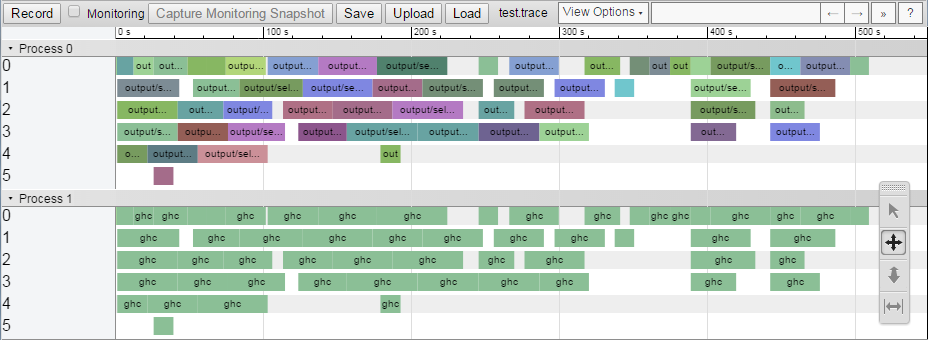

# Profiling and optimisation

This page discusses how to profile and optimise a Shake-based build system. In general there are two extremes of build system performance -- when nothing has changed (also known as the zero build), and when everything has changed or when building from scratch (the full build). By optimising both extremes, and ensuring dependencies are minimal, we typically ensure good performance everywhere.

Before doing any performance investigation, make sure you are passing a suitable parallelism flag (`-j` to automatically determine parallelism, `-j8` for 8 threads). Note also that Shake uses random scheduling, which offers a significant speedup by avoiding worst-case behaviour, but does make reproducing numbers harder than it would otherwise be.

Shake features a number of different profiling tools, each capable of investigating different aspects of performance, which we now discuss. With all uses of `--profile`, to investigate the previous run pass `--no-build`.

## Console profile reports

The simplest way to view the performance of a build is to pass `--profile=-` which prints a minimal profile report to the console. From the console profile report you can get a good sense of how large the build is and where the largest hotspot is. As an example:

<pre>
<!-- nosyntax -->* This database has tracked 7 runs.
* There are 466 rules (146 rebuilt in the last run).
* Building required 56 traced commands (23 in the last run).
* The total (unparallelised) time is 4m53s of which 4m43s is traced commands.
* The longest rule takes 10.3s (Development/Make/Rules.o),
  and the longest traced command takes 10.1s (ghc).
* Last run gave an average parallelism of 3.12 times over 1m05s.
</pre>

Looking at the information above:

* We have executed the build 7 times since we last wiped the Shake database (typically with a `clean` command).
* There are 466 rules, which includes things like files, oracles and anything else that Shake tracks. In the the run 146 of them required rebuilding because they were dirty, or are always run (e.g. oracles).
* If you were to run the build single threaded at `-j1`, ignoring any machine contention, it would take 4 minutes 53 seconds. Out of that, 4m43s was captured by `traced` commands, typically running `cmd` -- so the remaining 10s is probably Shake overheads and executing your Haskell code.
* The longest single rule is the one to build `Development/Make/Rules.o`, which takes 10.3s, and the longest traced command is running `ghc` for 10.1s. It's probably a good guess that `Rules.o` was the one running that longest `ghc`.
* In the last run it took 1m05s, and in that time we had an average of 3.12 traced commands running at a time. Assuming we passed `-j4` then we're doing reasonable at getting parallelism.

The `--profile=-` command provides a subset of the information generated by the [HTML profile reports](#html-profile), formatted for the console.

## Timing information

While the console profile report focuses on what your build system did, the timing information focuses on what Shake did. By passing `--timing` we get the output:

<pre>
<!-- nosyntax -->shakeArgsWith                       0.000s    0%
Function shake                      0.004s    0%
Database read                       0.021s    1%
With database                       0.002s    0%
Running rules                       1.917s   92%  =======================
Pool finished (32 threads, 4 max)   0.000s    0%
Lint checking                       0.081s    4%  =
Profile report                      0.062s    3%  =
Total                               2.087s  100%
</pre>

Each line indicates one step of the build -- e.g. `shakeArgsWith` is the instant the first Shake function is called, and the `0.000s` measures the time until the next step -- when the underlying `shake` function is called -- and covers the time required to parse the command line arguments. The only steps that are expected to take a meaningful amount of time are:

* Database read, which has to deserialise the Shake database. If this value is large, look at if your `.shake.database` file is large. If you have custom oracles they might be serialising to a large result. If you are dynamically changing filename every run that will result in lots of stale values.
* Running rules, when all your rules are run. The other profiling methods can shed light on what is actually happening when your rules are running. In a full build this step should be expected to take nearly 100% of the time.
* Pool finished is expected to take no time, but says how many threads were used by the thread pool in total (32 in this example), and the peak number of simultaneous threads (here there are 4).
* Lint checking only occurs if you pass `--lint` and is the time to execute the final lint checks.
* Profile report only occurs if you pass `--profile` and is the time to generate the profile information.

The `==` bars are a histogram, allowing quick visual identification of where most time was spent.

## Console output

By default Shake build systems run at `Normal` `Verbosity`, which prints errors and command names. By passing `--verbose` (or `-V`) you can increase the verbosity to `Loud`, which prints full command lines. By passing further `--verbose` flags (or `-VV`) you can increase the verbosity to `Chatty` which also includes when build rules starting being executed, and finally to `Diagnostic`, which is basically a complete list of every decision Shake makes. As a quick visual form of debugging, `Chatty` is sometimes helpful.

Sometimes adding your own output can help understand what is happening, using functions such as `putLoud` to write to the console. To compute timing information to print in such messages either use [`duration`](https://hackage.haskell.org/package/extra/docs/System-Time-Extra.html#v:duration) from [the `extra` library](https://hackage.haskell.org/package/extra), or `CmdTime`. As an example:

    CmdTime t <- cmd "leftpad -n4" [input] "-o" [output]
    putLoud $ "Padding took " ++ show t ++ " seconds"

A useful step to understand performance of the zero build is to add a `putStrLn` as the very first action of `main`, before calling any Shake functions. Such a print statement can be useful to help diagnose any slowdown caused by shell scripts invoking your binary or compiling it.

## HTML profile reports

In order to explore performance of the build system in greater detail you can use the HTML profile reports. To generate an HTML report, run `build --profile`, which will generate an interactive HTML profile named `report.html`. This report lets you examine what happened in that run, what takes most time to run, what rules depend on what etc. There is a help page included in the profiling output, and a [profiling tutorial/demo](https://cdn.rawgit.com/ndmitchell/shake/35fbe03c8d3bafeae17b58af89497ff3fdd54b22/html/demo.html).

You can also get all the raw information in JSON format by specifying `--profile=output.json`.

## Haskell profiling

The Shake profiling groups time by rule names and phases of the build, but if you want to group by implementation code the Haskell profiling can be useful. Since Shake programs are normal Haskell, the standard profiling steps can be used, roughly:

* Compile your program with `-rtsopts -auto-all -caf-all`.
* Run with `+RTS -p -RTS`.
* View the resulting `.prof` file.

In some versions of GHC profiles may generate incorrectly when combined with `-I0`, so you may need to omit that flag.

Often most of the build time will be spent calling out to commands, which can be well profiled with the existing Shake mechanisms, and just contribute noise to the Haskell profiling. By passing `--no-command` you can avoid running any `cmd` calls which don't return any results (return type `Action ()`). If any of your other actions can be similarly avoided you can examine the `shakeRunCommands` flag of `ShakeOptions`.

## Chrome traces

The final profiling mode lets you trace what happened. To generate a report run `--profile=report.trace`. The resulting `report.trace` file can be opened in Google Chrome by navigating to the `chrome://tracing/` page and hitting 'Load'. Both process 0 and process 1 show `traced` actions (typically commands), with process 0 being the rule name and process 1 being the command name.

